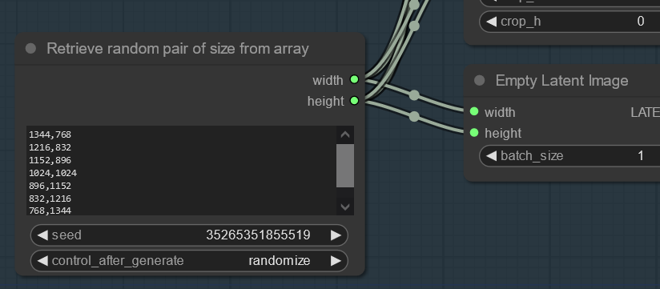

# ComfyUI-SizeFromArray

  

- Custom node for [ComfyUI](https://github.com/comfyanonymous/ComfyUI).
- Add node that outputs random pair of width and height from given array.

## Installation
```
cd <ComfyUI directory>/custom_nodes
git clone https://github.com/ITurchenko/ComfyUI-SizeFromArray.git
```